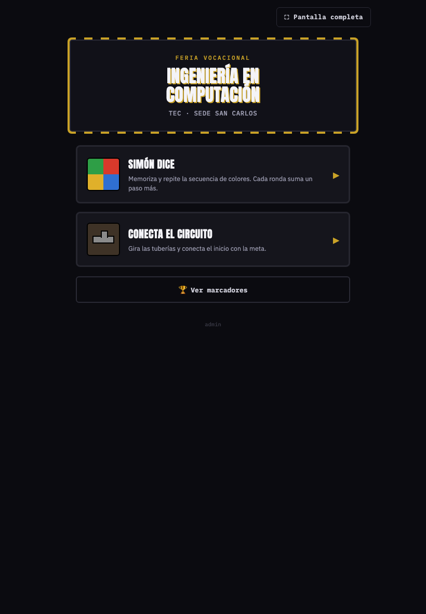
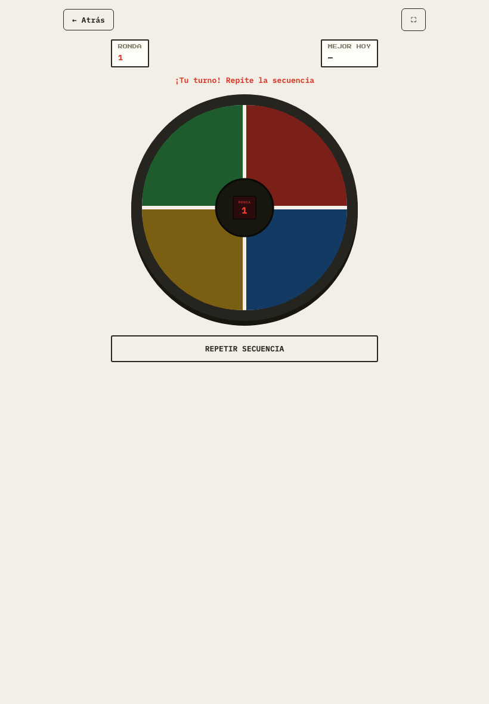
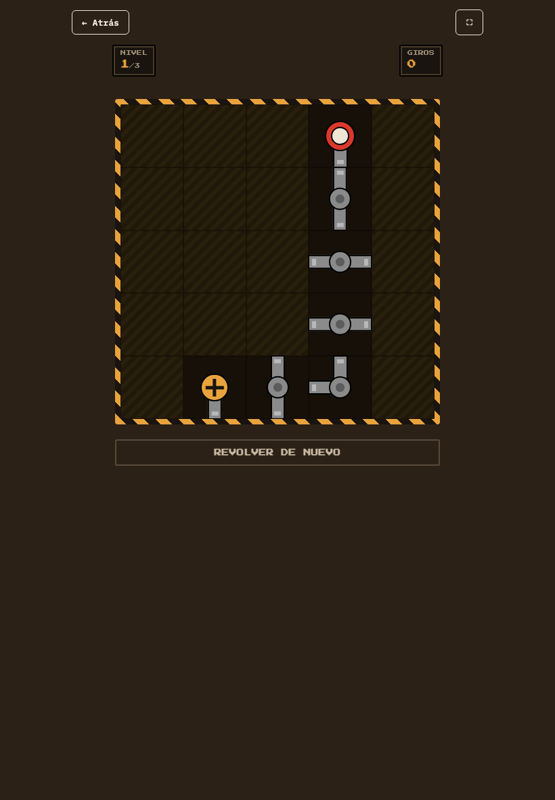
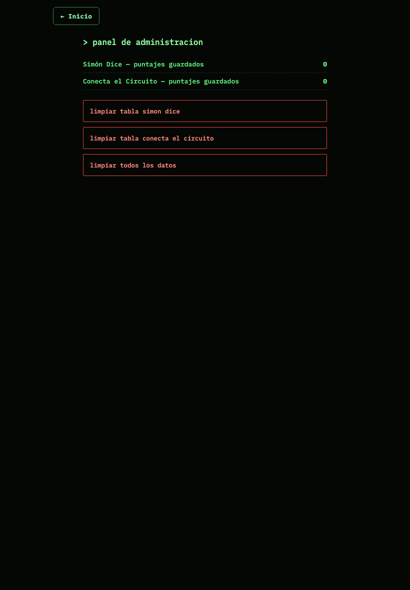

# Feria Vocacional — Ingeniería en Computación TEC San Carlos

Dos juegos de arcade para el stand de la feria vocacional, pensados para correr
en iPads **sin conexión a internet**. Todo vive en un único archivo HTML
(`feria-tec.html`) para que el hub, ambos juegos, los marcadores y el panel de
administración compartan el mismo almacenamiento local del navegador.

## Abrir

Abre `feria-tec.html` directamente en Safari/Chrome. En iPad, usa **Compartir →
Agregar a pantalla de inicio** para que corra sin la barra de Safari (más
confiable que el botón de pantalla completa dentro de la página, que también
está disponible como respaldo).

## Juegos

- **Simón Dice** — memoriza y repite la secuencia de colores; cada ronda suma
  un paso más. Basado en el diseño original de Milton Bradley (1978).
- **Conecta el Circuito** — gira tuberías 90° para conectar el inicio con la
  meta. Estética inspirada en Pipe Dream / Pipe Mania (1989).

## Marcadores y datos

Los puntajes se guardan en `localStorage`, 100% local — **cada iPad mantiene
su propio marcador**, ya que no hay red para sincronizar entre tablets.

Panel de administración en `feria-tec.html#admin` (o el enlace discreto
"admin" al pie del menú principal) para borrar los datos guardados.

## Capturas

| Menú principal | Simón Dice | Conecta el Circuito |
|---|---|---|
|  |  |  |

| Marcadores | Admin |
|---|---|
|  |  |

## Otros archivos

- `simon-tec.html`, `conecta-circuito-tec.html` — versiones independientes de
  cada juego (anteriores a la unificación en `feria-tec.html`).
